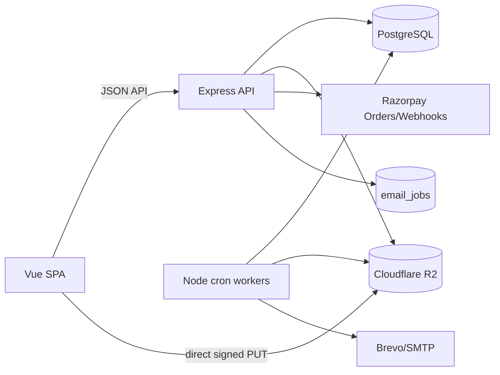
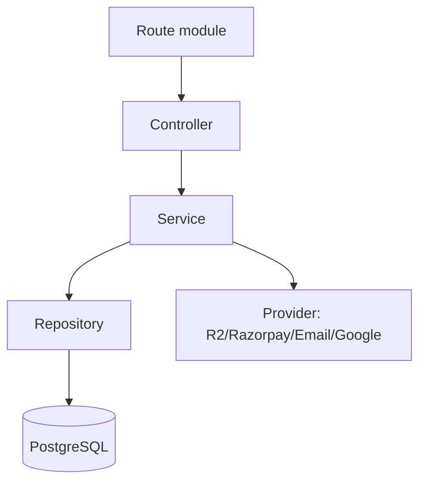
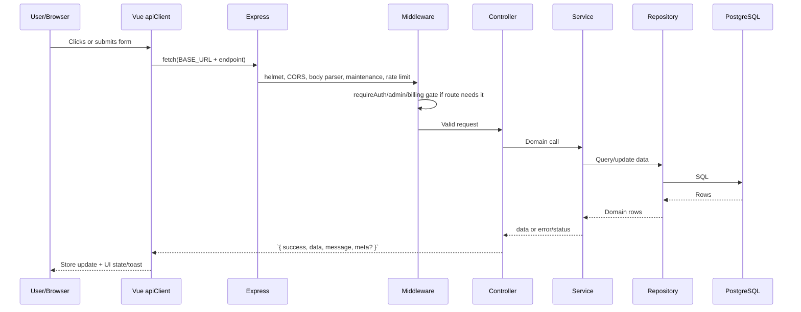
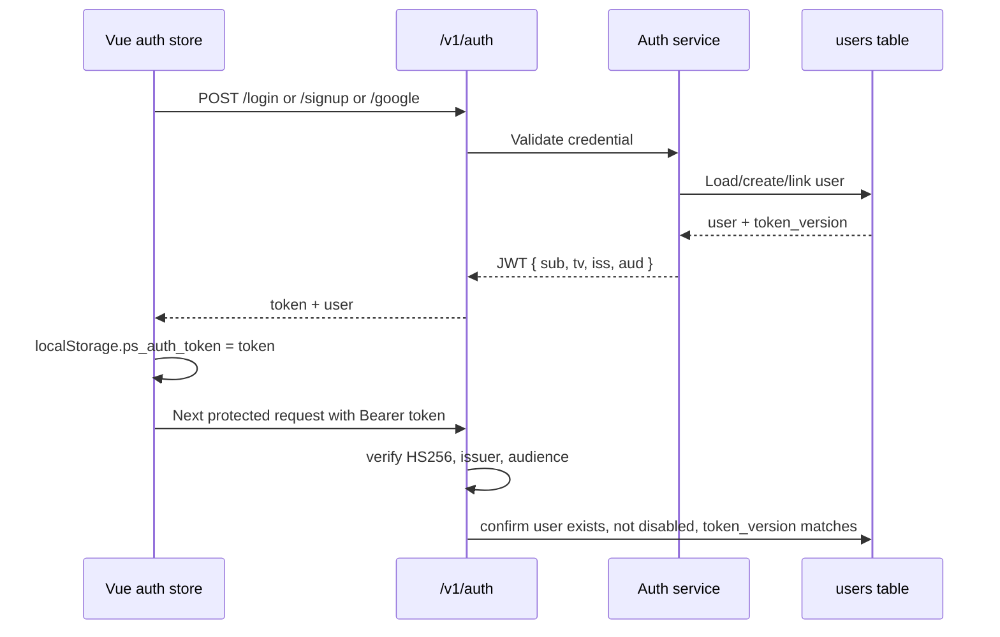
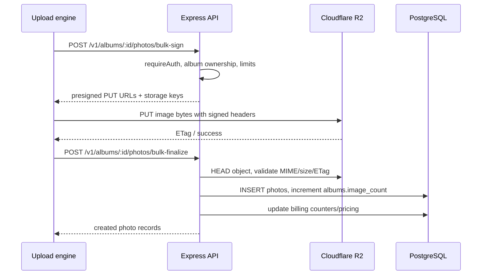
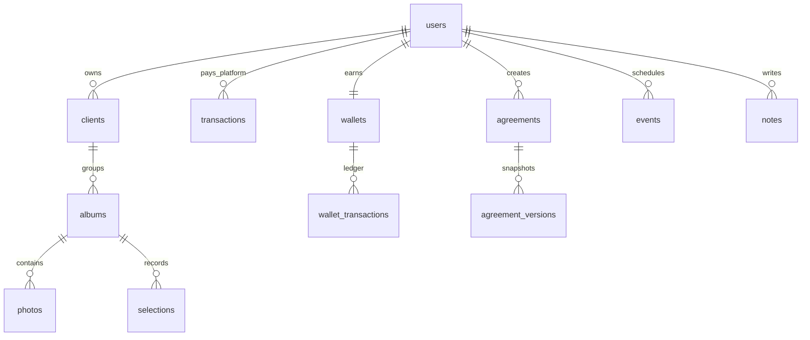

# Architecture

Related docs: [Project Map](./PROJECT_MAP.md), [Database](./DATABASE.md), [API Reference](./API_REFERENCE.md), [Environment](./ENVIRONMENT.md), [Deployment](./DEPLOYMENT.md).

## System Overview

The frontend is a Vue 3 SPA with Pinia and typed service wrappers. The backend is an Express app with layered modules:

## Request Lifecycle

Important request behavior:

- `src/api/client.ts` adds `Authorization: Bearer <ps_auth_token>` from local storage.
- Backend rate limits are global under `/v1`, stricter for auth and payments, and admin-scoped under `/v1/admin`.
- 401 responses clear `ps_auth_token` and redirect to `/login` or `/admin/login`.
- 503 `MAINTENANCE_MODE` responses route non-admin users to `/maintenance`.
- Backend error handling is centralized in `src/middleware/errorHandler.js`.

## Authentication Flow

Supported sign-in paths:

- Password signup/login: `src/services/password-auth.service.js`; signup requires email, password, phone, and OTP.
- Google sign-in: `src/services/google-auth.service.js`; verifies Google ID token and links by normalized email.
- Admin login: `src/services/admin-auth.service.js`; compares against `ADMIN_EMAIL` and `ADMIN_PHONE`, then issues a normal JWT for an admin user.
- Public client gallery access: uses opaque `shareId` and optional access code/session, not photographer JWT.
- Public agreement access: uses opaque `public_token` and email OTP for acceptance.

JWT hardening:

- Tokens are HS256 only.
- `JWT_ISSUER` and `JWT_AUDIENCE` are verified.
- `token_version` in the token is compared with `users.token_version` on every protected request.
- Disabled users are rejected immediately.
- A short user-cache reduces DB pressure while still enforcing revocation within a small TTL.

## File Upload Flow

The primary upload path is direct-to-R2. The backend signs uploads and finalizes DB rows; the browser sends bytes directly to Cloudflare R2.

Fallback/legacy path:

- `POST /v1/albums/:albumId/photos` accepts multipart via `multer.memoryStorage`.
- The API validates image bytes, uploads server-side to R2, inserts `photos`, and increments `albums.image_count`.

Frontend upload architecture:

- `src/services/upload` owns IndexedDB persistence, queue state, resume, and worker pool orchestration.
- `src/stores/upload.ts` exposes UI state.
- `src/components/upload/*` renders upload zone, progress, review/confirm, and global upload dock.
- Auth store scopes upload IndexedDB per user and resumes paused jobs after login.

Backend upload safety:

- Allowed photo MIME types are JPEG, PNG, WebP, HEIC, HEIF.
- `MAX_FILE_SIZE_MB` caps upload sizes.
- R2 keys are namespaced under `framedrops/<albumId>/...`.
- Finalize validates the object by `HEAD` before inserting DB rows.
- Orphan and reconciliation workers clean or audit R2 objects.

## Background Workers

Workers start after the HTTP server listens:

| Worker | Purpose |
|---|---|
| `albumExpiry.worker.js` | Expire albums and clean deleted/expired album data in batches. |
| `r2OrphanReaper.worker.js` | Delete R2 objects left without finalized DB rows. |
| `r2Reconciliation.worker.js` | Sample DB/R2 consistency. |
| `email.worker.js` | Drain `email_jobs` and write `email_logs`. |
| `lifecycle.worker.js` | Send lifecycle reminders such as expiry notices and extension prompts. |
| `stalePending.worker.js` | Heal stale pending payment/order states. |
| `calendar.worker.js` | Send calendar reminders. |
| `trialExpiry.worker.js` | Expire free trials. |
| `agreementExpiry.worker.js` | Expire old agreements. |

## Core Data Ownership

## Deployment Shape

- Frontend builds to static assets using Vite, sitemap generation, and prerender scripts.
- Backend runs as a Node process with `node server.js`.
- PostgreSQL is required through `DATABASE_URL`.
- R2 is required for production photo/PDF storage.
- Razorpay is required for platform and client payment flows.
- Email can run via Brevo API/SMTP configuration.
