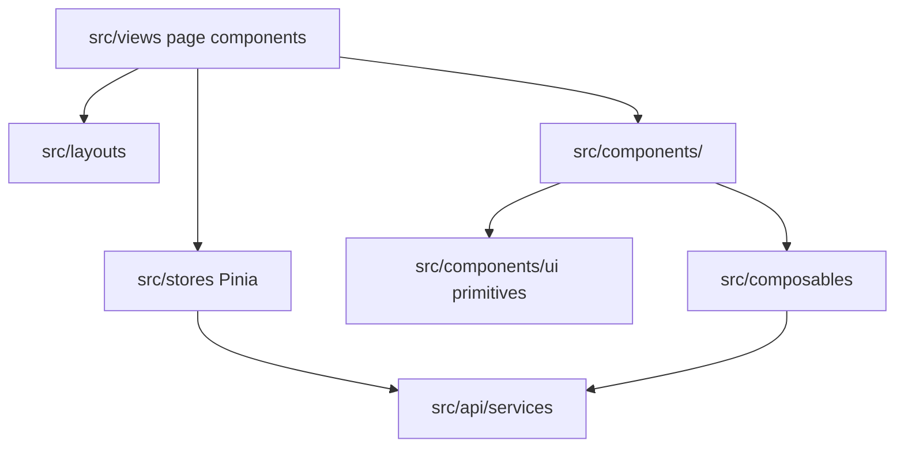
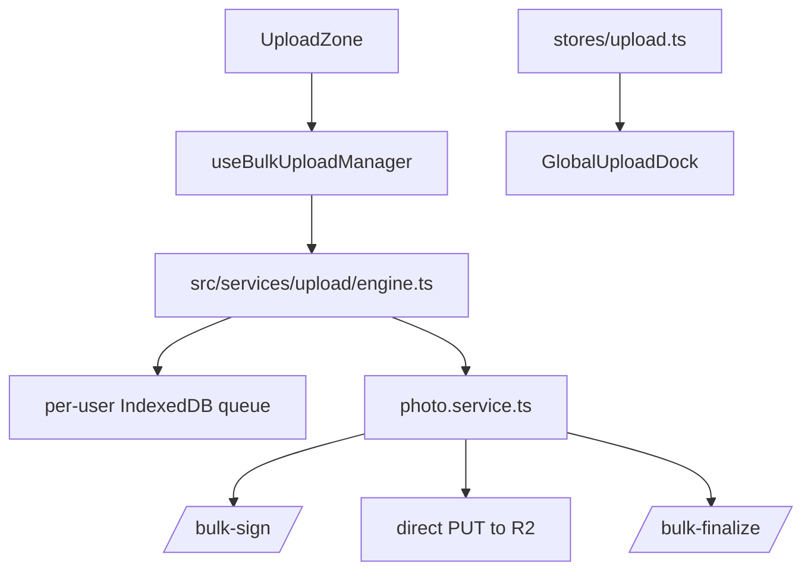

# Components

Related docs: [Features](./FEATURES.md), [Project Map](./PROJECT_MAP.md), [API Reference](./API_REFERENCE.md).

## Frontend Component Architecture



## View Directories

| Directory | Purpose |
|---|---|
| `views/admin` | Admin console screens for analytics, users, albums, wallets, payments, campaigns, system health, feedback, coupons, notifications. |
| `views/agreements` | Photographer agreement list/builder and public customer agreement signing. |
| `views/albums` | Album list, detail/gallery management, album tracking. |
| `views/auth` | Login, signup, reset, forgot password, admin login. |
| `views/calendar` | Photographer event calendar and notes. |
| `views/client` | Public gallery, client folder gallery, access/payment gates. |
| `views/clients` | Photographer client list and client albums. |
| `views/dashboard` | Main photographer dashboard. |
| `views/docs`, `views/help` | Product help and getting started screens. |
| `views/legal` | Terms and privacy pages. |
| `views/seo` | SEO landing pages and blog rendering. |
| `views/settings` | Profile, branding, support, coming-soon feature surfaces. |
| `views/uploads` | Upload queue/status surface. |
| `views/wallet` | Earnings, payout methods, withdrawals, transaction history. |

## Component Directories

| Directory | Key components | Notes |
|---|---|---|
| `components/admin` | `AdminTable`, `KpiCard`, `FilterBar`, `DetailDrawer`, `AdminNotificationBell` | Shared admin UI. |
| `components/agreements` | `AgreementsOverview`, `AgreementCreditsModal`, `AgreementPdfDocument` | Agreement dashboard and document rendering. |
| `components/auth` | `GoogleSignInButton`, `TurnstileWidget` | Auth provider and bot-check UI. |
| `components/billing` | `FreeTrialBanner`, `UpgradeModal`, `AlbumLifecyclePanel`, `PlatformDuesModal` | Billing and lifecycle prompts. |
| `components/calendar` | `CalendarGrid`, `CalendarWeekView`, `EventCard`, `NotesPanel` | Calendar display and CRUD dialogs. |
| `components/campaign` | `FrameyRoad`, `FrameyWave` | Campaign visuals. |
| `components/feedback` | `FeedbackDialog`, `StarRating` | Feedback capture/review. |
| `components/gallery` | `ImageGrid`, `PreviewModal`, `ShareDialog`, `CopySelectedDialog`, `WatermarkOverlay`, `AlbumPreview` | Photo gallery rendering and selection workflows. |
| `components/landing` | `HeroSection`, `FeaturesSection`, `PricingSection`, etc. | Public landing page sections. |
| `components/legal` | `LegalHero`, `LegalSection`, `LegalSidebar`, `ScrollProgress` | Legal page scaffolding. |
| `components/navigation` | `SideNav`, `MobileMenu`, `Breadcrumb`, `RouteProgressBar` | App navigation. |
| `components/seo` | `SeoLandingTemplate` | Shared SEO landing page layout. |
| `components/settings` | `NotificationsPreferences`, `StudioWebsiteComingSoon` | Settings panels. |
| `components/tour` | `ProductTour` | Guided tour UX. |
| `components/ui` | `AlbumCard`, `ClientFormDialog`, `EmptyState`, `StatCard`, `ToastHost`, dates/times, dialogs | Shared app primitives. |
| `components/upload` | `UploadZone`, `UploadProgress`, `GlobalUploadDock`, `UploadJobRow`, `ReviewConfirmPanel` | Resumable upload UI. |
| `components/wallet` | `PayoutMethodCard`, `PayoutMethodDialog`, `ConfirmDeleteDialog` | Payout method UX. |

## State Stores

| Store | Owns |
|---|---|
| `auth.ts` | Current user, JWT, login/signup/reset/profile updates, logout cleanup, upload DB scoping. |
| `albums.ts`, `clients.ts` | Photographer gallery and customer data. |
| `upload.ts` | Upload queue/progress status surfaced from upload engine. |
| `billing.ts` | Billing status, trial, locked albums, platform dues, album tracking. |
| `notifications.ts`, `adminNotifications.ts` | Notification lists/unread counts. |
| `calendar.ts` | Events and notes. |
| `agreements.ts` | Agreement list/detail/credit state. |
| `payoutMethods.ts` | Payout destination state. |
| `admin*.ts`, `campaigns.ts` | Admin dashboard/search/reporting/campaign state. |
| `toast.ts`, `dialog.ts` | Global UI feedback and confirmation state. |
| `featureInterests.ts`, `announcements.ts`, `marketing.ts` | Supporting product/marketing state. |

## API Service Pattern

All normal JSON calls should use:

```ts
import { apiClient } from '@/api/client'
import { ENDPOINTS } from '@/api/endpoints'
```

Rules of thumb:

- Put endpoint strings in `src/api/endpoints.ts`.
- Put domain wrappers in `src/api/services/<domain>.service.ts`.
- Use direct `fetch` only for special cases such as signed R2 PUTs or `/api/upload` outside the `/v1` base.
- Keep `VITE_*` reads centralized in `src/config/*` where possible.

## Upload Component Flow



## Adding a New UI Feature

1. Add or reuse endpoint constants and service functions.
2. Decide whether state belongs in a Pinia store or the page component.
3. Put page-level composition in `src/views/<domain>`.
4. Put reusable pieces in `src/components/<domain>` or `src/components/ui`.
5. Add focused Vitest specs near stores/services/components when behavior is non-trivial.
