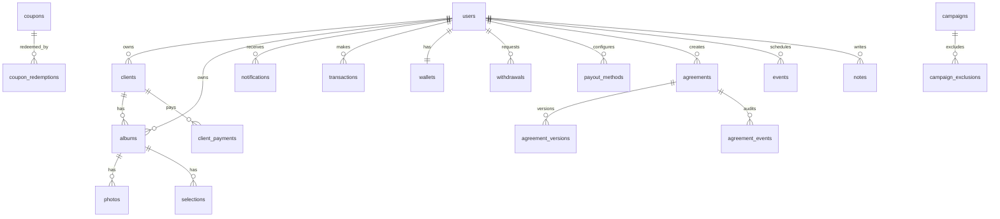

# Database

Related docs: [Architecture](./ARCHITECTURE.md), [API Reference](./API_REFERENCE.md), [Environment](./ENVIRONMENT.md).

The canonical schema is `framedropsbe/src/database/full_schema_v2.sql`. Incremental changes live in `framedropsbe/src/migrations`.

## Entity Relationship Overview

## Table Catalog

| Table | Purpose | Main APIs/modules |
|---|---|---|
| `users` | Photographer/admin accounts, auth provider fields, profile/branding, trial state, lockout, token version. | `/v1/auth/*`, `/v1/admin/users`, profile/branding settings |
| `otp_codes`, `phone_otp_codes`, `otp_rate_limits`, `otp_attempts` | OTP generation, verification, and abuse controls. | Signup, admin auth, agreement OTP |
| `clients` | Photographer customers/folders, share IDs, delivery/payment settings, trial marker. | `/v1/clients/*`, client gallery collection |
| `client_otp_codes`, `client_sessions` | Public gallery access-code verification/session state. | `/v1/client-auth/verify-code` |
| `client_deliveries` | Client delivery/payment grouping. | Client payments, albums |
| `albums` | Event/gallery albums with share ID, status, lock/expiry/payment metadata and image counts. | `/v1/albums/*`, `/gallery/:shareId`, billing |
| `photos` | Photo metadata and R2 storage keys/URLs, selection status. | `/v1/albums/:id/photos*`, selections, transfer |
| `selections` | Client selection/comment records per album/photo. | `/v1/selections/*` |
| `notifications`, `admin_notification_reads` | User/admin notification feed and read state. | `/v1/notifications/*`, `/v1/admin/notifications/*` |
| `coupons`, `coupon_redemptions` | Discount setup and redemption tracking. | `/v1/coupons/validate`, `/v1/admin/coupons/*` |
| `transactions` | Photographer-to-platform Razorpay payments. | `/v1/payments/*`, admin payments/revenue |
| `album_extensions` | Paid per-album extension orders. | `/v1/albums/:id/extensions/*` |
| `platform_dues` | Platform amounts owed by photographers. | `/v1/billing/platform-dues`, admin platform dues |
| `wallets`, `wallet_transactions` | Photographer earnings balance and ledger. | `/v1/wallet/*`, `/v1/payments/wallet/*`, admin wallets |
| `client_payments` | Customer-to-photographer Razorpay payments. | `/v1/client-payments/*`, admin client payments |
| `payout_methods`, `withdrawals` | Payout destinations and withdrawal workflow. | `/v1/payout-methods/*`, `/v1/withdrawals/*`, admin withdrawals |
| `album_access_codes` | Gallery/client access codes generated by photographer. | `/v1/albums/:id/access-code`, `/v1/clients/:id/access-code` |
| `admin_audit_log` | Admin action history. | `/v1/admin/audit-log` |
| `worker_heartbeats` | Worker liveness/health reporting. | Admin system health/capacity |
| `lifecycle_email_log` | De-duplication and audit for lifecycle emails. | lifecycle worker |
| `webhook_events` | Idempotency/audit for payment webhooks. | `/v1/webhook/razorpay` |
| `events`, `notes` | Photographer calendar events and daily notes. | `/v1/calendar/*` |
| `email_jobs`, `email_logs` | Async email queue and delivery log. | email worker, admin email jobs |
| `feedbacks` | Photographer/customer feedback and testimonials. | `/v1/feedback/*`, `/v1/public/testimonials`, admin feedback |
| `feature_interests` | User interest toggles for coming-soon features. | `/v1/feature-interests/*`, admin feature interest |
| `announcements` | In-app announcements by audience. | `/v1/announcements/active`, admin announcements |
| `system_settings` | Maintenance mode and runtime settings. | `/v1/system/status`, `/v1/admin/system/*` |
| `agreements`, `agreement_versions`, `agreement_events` | Customer agreement lifecycle, public token, version snapshots, audit events. | `/v1/agreements/*`, `/v1/agreement/:token/*` |
| `campaigns`, `campaign_exclusions` | Admin-managed campaigns and leaderboards. | `/v1/public/campaigns/:slug`, `/v1/admin/campaigns/*` |

## API to Table Map

| API family | Primary tables | Secondary tables |
|---|---|---|
| `/v1/auth/*` | `users`, `otp_codes` | `notifications`, `email_jobs`, `otp_attempts`, `otp_rate_limits` |
| `/v1/auth/admin/*` | `users`, `otp_codes` | `admin_audit_log` |
| `/v1/clients/*` | `clients`, `albums` | `album_access_codes`, `client_deliveries`, `email_jobs` |
| `/v1/albums/*` | `albums`, `photos`, `clients` | `album_access_codes`, `album_extensions`, `platform_dues`, `transactions` |
| `/v1/selections/*` | `selections`, `photos`, `albums` | `notifications`, `email_jobs` |
| `/v1/billing/*` | `users`, `clients`, `albums`, `transactions`, `platform_dues` | `album_extensions`, `coupon_redemptions` |
| `/v1/payments/*` | `transactions`, `coupons`, `coupon_redemptions` | `webhook_events`, `wallet_transactions`, `platform_dues` |
| `/v1/client-payments/*` | `client_payments`, `clients`, `client_deliveries` | `wallets`, `wallet_transactions`, `webhook_events` |
| `/v1/wallet/*` | `wallets`, `wallet_transactions` | `client_payments`, `transactions` |
| `/v1/withdrawals/*` | `withdrawals`, `payout_methods`, `wallets` | `wallet_transactions`, `notifications` |
| `/v1/calendar/*` | `events`, `notes` | `clients`, `albums`, `email_jobs` |
| `/v1/agreements/*` | `agreements`, `agreement_versions`, `agreement_events` | `users`, `clients`, `otp_codes`, `transactions` |
| `/v1/notifications/*` | `notifications` | `admin_notification_reads` |
| `/v1/admin/*` | Cross-domain reporting over most tables | `admin_audit_log`, `worker_heartbeats`, `system_settings` |

## Migration Notes

- `full_schema_v2.sql` includes current tables and indexes for local bootstrap/reference.
- Migration files `01_...` through `16_...` capture later feature additions such as transfer status, announcements, client delivery fields, trial enforcement, agreements, campaigns, and platform dues.
- When adding a feature, update the schema reference and add an incremental migration if existing deployments need to evolve.

## Data Invariants

- `albums.user_id` and `clients.user_id` tie all photographer-owned resources to a user.
- `photos.album_id` cascades with album deletion.
- Public gallery access uses opaque `albums.share_id` or `clients.share_id`.
- Agreement public access uses `agreements.public_token`.
- Payment webhooks should be idempotent via `webhook_events`.
- Wallet updates should be represented in both `wallets` balance fields and `wallet_transactions` ledger entries.
