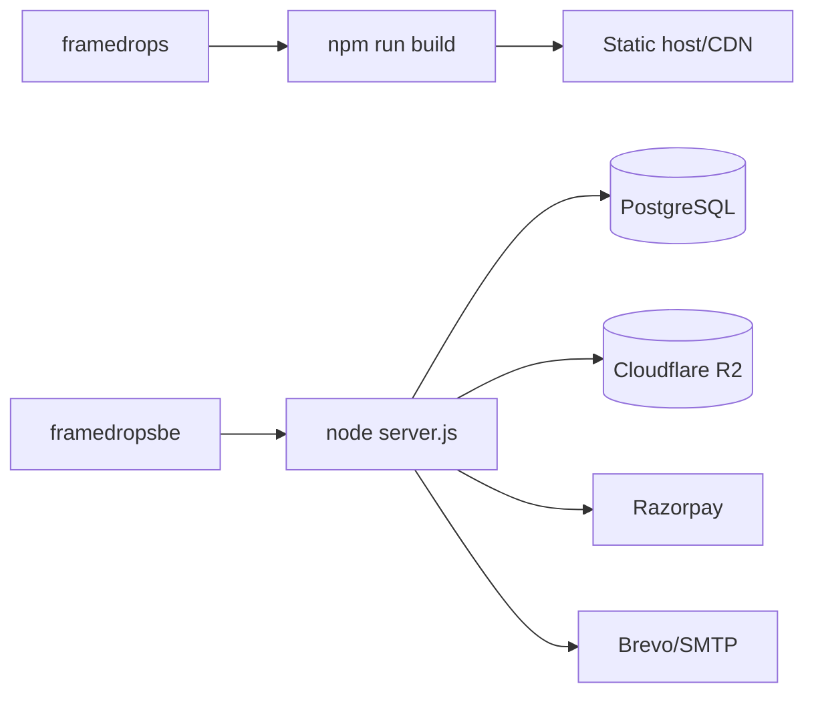

# Deployment

Related docs: [Environment](./ENVIRONMENT.md), [Architecture](./ARCHITECTURE.md), [Database](./DATABASE.md).

## Build and Runtime Overview

## Frontend

Project: `framedrops`

Common commands:

| Command | Purpose |
|---|---|
| `npm run dev` | Local Vite dev server. |
| `npm run build:spa` | Type-check with `vue-tsc`, then Vite build. |
| `npm run sitemap` | Generate sitemap. |
| `npm run prerender` | Prerender static pages. |
| `npm run build` | Full static build: SPA build, sitemap, prerender. |
| `npm run build:cf` | Cloudflare-style build without prerender. |
| `npm run preview` | Preview built app. |
| `npm run test` | Vitest suite. |
| `npm run lint` | ESLint. |

Production requirements:

- `VITE_API_BASE_URL` should point to backend `/v1`, for example `https://api.framedrops.in/v1`.
- Public `VITE_*` env vars are baked into the bundle; never put secrets there.
- Static host should serve SPA fallback to `index.html` for app routes.
- SEO pages rely on generated sitemap/prerender output.

## Backend

Project: `framedropsbe`

Common commands:

| Command | Purpose |
|---|---|
| `npm run dev` | Node watch mode. |
| `npm start` | Production server command. |
| `npm run backup:db` | Upload DB backup to R2. |
| `npm run restore:db` | Restore DB backup from R2 to target database. |

Production boot sequence:

1. `instrument.js` loads dotenv, Sentry, and DNS/bootstrap instrumentation first.
2. `server.js` validates production safety guards.
3. Express middleware mounts: Helmet, CORS, parsers, maintenance mode, rate limits.
4. Swagger is mounted if enabled, but forced off in production.
5. Routes mount under `/v1` and `/api/upload`.
6. HTTP server starts.
7. Background workers start.

Production safety guards:

- `OTP_PROVIDER=mock` is forbidden in production.
- `MOCK_OTP_CODE` is forbidden in production.
- `JWT_SECRET` must exist and be at least 32 characters in production.
- `SWAGGER_ENABLED` is forced to `false` in production.

## Infrastructure Dependencies

| Dependency | Required for | Key env |
|---|---|---|
| PostgreSQL | All app state | `DATABASE_URL`, `PG_POOL_MAX` |
| Cloudflare R2 | Photos, PDFs, backups | `R2_*`, `MAX_FILE_SIZE_MB` |
| Razorpay | Platform/client payments | `RAZORPAY_*` |
| Email provider | OTP, welcome, lifecycle, support, reminders | `BREVO_API_KEY`, `SMTP_ENABLED`, sender/support vars |
| Google OAuth | Optional Google sign-in | `GOOGLE_AUTH_ENABLED`, OAuth client IDs |
| Sentry | Optional error monitoring | `SENTRY_DSN`, `VITE_SENTRY_DSN` |
| Turnstile | Optional bot protection | `TURNSTILE_SECRET`, `VITE_TURNSTILE_SITE_KEY` |

## Health Checks and Monitoring

- Backend liveness/readiness: `GET /health`.
- The health check returns 200 only when Express is up and PostgreSQL answers `SELECT 1` within roughly 2 seconds.
- Admin system health and capacity pages read backend analytics, worker heartbeat, DB, and storage-derived metrics.
- Workers should update or expose status through `worker_heartbeats` where implemented.

## Database Backup and Restore

Scripts:

- `scripts/backup-db.js`
- `scripts/restore-db.js`
- `src/workers/dbBackup.worker.js`

Backup/restore uses `DATABASE_URL`, R2 credentials, `BACKUP_RETENTION_DAYS`, `BACKUP_NOTIFY_EMAIL`, and optional Brevo notification settings.

Restore is guarded against accidentally restoring into the source database by checking `TARGET_DATABASE_URL` against `DATABASE_URL`.

## Deployment Checklist

1. Set backend secrets from [Environment](./ENVIRONMENT.md).
2. Run migrations/schema setup against PostgreSQL.
3. Verify R2 bucket, public host, and CORS allow browser PUTs from the frontend domain.
4. Configure Razorpay keys and webhook URL: `https://<api-host>/v1/webhook/razorpay`.
5. Configure frontend `VITE_API_BASE_URL`.
6. Build frontend with `npm run build`.
7. Start backend with `npm start`.
8. Check `/health`.
9. Smoke test signup/login, create client, create album, upload, share, select, and payment test mode.
