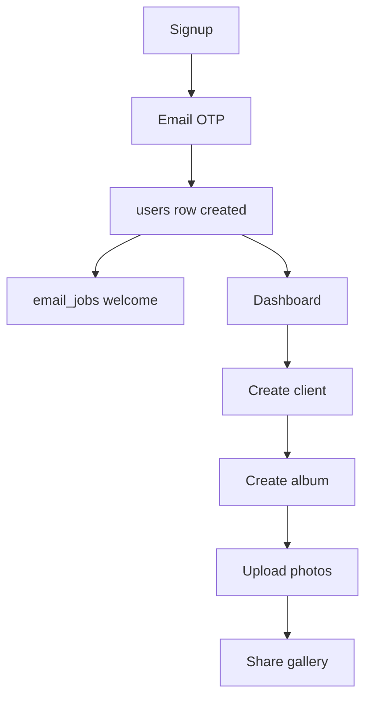
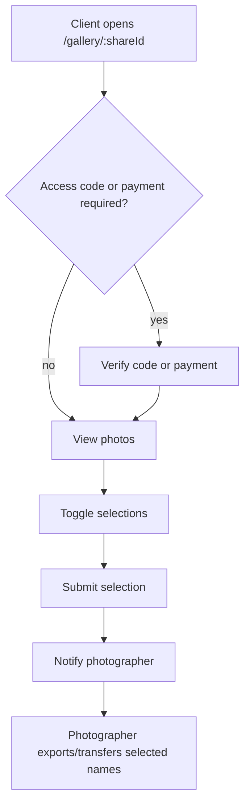
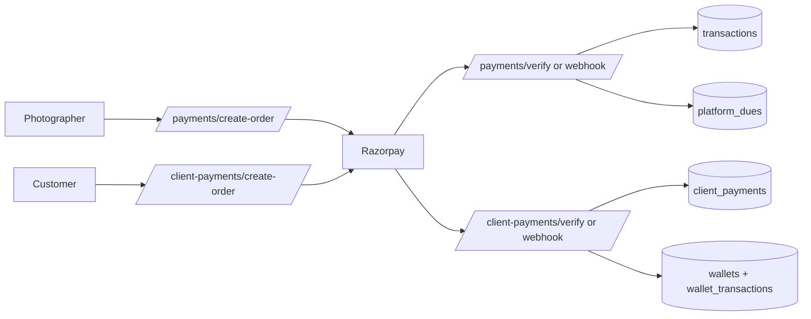

# Features

Related docs: [API Reference](./API_REFERENCE.md), [Components](./COMPONENTS.md), [Database](./DATABASE.md), [Architecture](./ARCHITECTURE.md).

## Feature Areas

| Feature | Frontend | Backend | Tables |
|---|---|---|---|
| Photographer auth | `views/auth`, `stores/auth.ts` | `auth.routes.js`, `password-auth.service.js`, `google-auth.service.js` | `users`, `otp_codes` |
| Client management | `views/clients`, `components/ui/Client*` | `client.routes.js`, `client.service.js` | `clients`, `albums`, `client_deliveries` |
| Album galleries | `views/albums`, `components/gallery`, `components/ui/AlbumCard.vue` | `album.routes.js`, `photo.routes.js`, `album.service.js`, `photo.service.js` | `albums`, `photos` |
| Bulk upload | `components/upload`, `services/upload`, `stores/upload.ts` | `/photos/bulk-sign`, `/photos/bulk-finalize`, R2 provider | `photos`, `albums` |
| Client selection | `views/client/ClientGalleryView.vue`, `selection.service.ts` | `selection.routes.js`, `selection.service.js` | `selections`, `photos`, `albums` |
| Payments and billing | `components/billing`, `payment.service.ts`, `billing.service.ts` | `payments`, `billing.service.js`, `razorpay.service.js` | `transactions`, `platform_dues`, `coupons` |
| Customer payments | `ClientPaymentGate.vue`, `client-payment.service.ts` | `clientPayments/*` | `client_payments`, `wallets`, `wallet_transactions` |
| Wallet and withdrawals | `views/wallet`, `components/wallet` | `wallet/*`, `withdrawals/*`, `payoutMethods/*` | `wallets`, `wallet_transactions`, `withdrawals`, `payout_methods` |
| Calendar | `views/calendar`, `components/calendar` | `calendar.routes.js`, calendar worker | `events`, `notes`, `email_jobs` |
| Agreements | `views/agreements`, `components/agreements` | `agreement.routes.js`, `public-agreement.routes.js` | `agreements`, `agreement_versions`, `agreement_events` |
| Notifications | `stores/notifications.ts`, notification bell/banner | `notification.routes.js`, `notification.service.js` | `notifications`, `admin_notification_reads` |
| Announcements/maintenance | `AnnouncementBanner`, `MaintenanceView.vue` | `announcement.routes.js`, `system.routes.js`, admin system | `announcements`, `system_settings` |
| Feedback/testimonials | `components/feedback`, public stats/testimonials | `feedback.routes.js`, admin feedback | `feedbacks` |
| Admin console | `views/admin`, `components/admin` | `src/admin/*` | cross-domain |
| SEO content | `views/seo`, `content/blog`, sitemap/prerender scripts | public stats/campaign endpoints | mostly static + `feedbacks`, `campaigns` |

## Main User Journeys

### Photographer Onboarding

### Client Gallery Selection

### Payment Flows

There are two payment tracks:

- Flow 1: photographer pays Framedrops for platform usage, album unlocks, credits, or extensions. Data lands in `transactions`, `platform_dues`, and sometimes wallet payment helpers.
- Flow 2: customer pays photographer. Data lands in `client_payments`, then photographer wallet ledger entries.

### Agreement Signing

1. Photographer creates an agreement in `/agreements/new`.
2. Backend stores `agreements` and `agreement_versions`.
3. Photographer sends agreement; client receives public `/agreement/:token`.
4. Client requests email OTP, accepts/rejects.
5. Backend appends `agreement_events`, updates status, and can generate PDF stored in R2.

## Access Models

| Surface | Access model |
|---|---|
| Photographer dashboard | JWT from `ps_auth_token`; backend verifies `users.token_version`. |
| Admin console | Same JWT format, but admin routes require admin role. |
| Public gallery | Opaque `shareId`, optional access code/client session/payment gate. |
| Public agreement | Opaque `public_token`, email OTP for acceptance. |
| Razorpay webhooks | Webhook signature and optional IP allowlist. |

## Feature Flags / Runtime Gates

- Google login: `GOOGLE_AUTH_ENABLED` backend and `VITE_GOOGLE_AUTH_ENABLED` frontend.
- Maintenance mode: `MAINTENANCE_MODE` env and `system_settings`.
- Launch pricing: `LAUNCH_PRICING_ENABLED`, `VITE_LAUNCH_PRICING_ENABLED`.
- Lifecycle emails: `LIFECYCLE_ENABLED`.
- Individual workers can be disabled with `*_WORKER_DISABLED` or worker-specific disabled vars.
- Swagger: `SWAGGER_ENABLED`, forced off in production.

## Onboarding Advice

- Add new frontend API paths to `src/api/endpoints.ts`, then wrap them in `src/api/services`.
- Keep page state in Pinia if multiple screens/components need it; keep local form state in the view/component.
- Backend changes should follow route -> controller -> service -> repository.
- Any data model change should update `full_schema_v2.sql`, add a migration when needed, and update [Database](./DATABASE.md).
