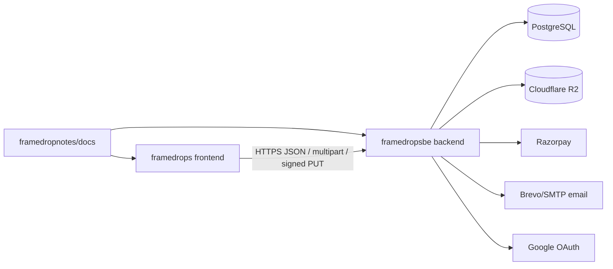
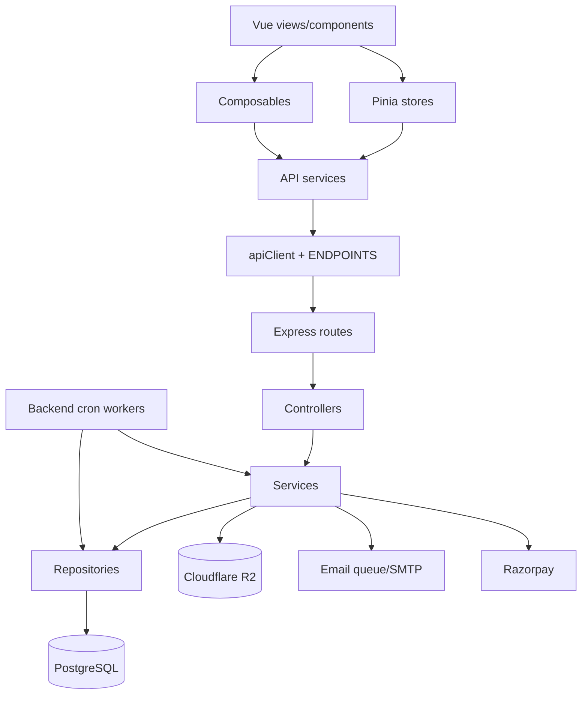

# Project Map

Framedrops is split across three sibling repositories:

- `framedrops` - Vue 3/Vite frontend for photographers, clients, SEO pages, and admin.
- `framedropsbe` - Express/PostgreSQL/R2 backend API, workers, payments, emails, and schema.
- `framedropnotes` - product, launch, runbook, interview, and onboarding documentation. This `/docs` folder lives here.

Related docs: [Architecture](./ARCHITECTURE.md), [Database](./DATABASE.md), [API Reference](./API_REFERENCE.md), [Features](./FEATURES.md), [Components](./COMPONENTS.md), [Deployment](./DEPLOYMENT.md), [Environment](./ENVIRONMENT.md).

## Repository Topology

## `framedrops` Important Folders

| Path | Purpose |
|---|---|
| `src/api` | API client, endpoint constants, typed service wrappers. Start here when wiring UI to backend. |
| `src/api/services` | Domain clients: auth, albums, photos, billing, agreements, admin, wallet, withdrawals, etc. |
| `src/router` | Route table, layouts, auth/admin guards, SEO metadata defaults. |
| `src/views` | Page-level Vue screens grouped by domain: admin, agreements, albums, auth, calendar, client, SEO, settings. |
| `src/components` | Reusable UI and domain components grouped by feature. See [Components](./COMPONENTS.md). |
| `src/stores` | Pinia state modules for auth, albums, clients, upload, billing, notifications, admin, etc. |
| `src/composables` | Reusable Vue behavior: upload managers, polling, SEO, toasts, confirm dialogs, Razorpay checkout. |
| `src/services/upload` | IndexedDB-backed resumable upload engine and worker pool. |
| `src/config` | Frontend config sourced from `VITE_*` env vars: pricing, contact, social, Sentry, Turnstile. |
| `src/content/blog` | SEO blog content registry and article modules. |
| `src/i18n` | Localization setup and locale files. |
| `src/layouts` | Blank, dashboard, admin, and client layout shells. |
| `src/lib`, `src/utils` | Analytics, helpers, auth-mode utilities, formatting and small shared logic. |
| `src/workers` | Browser worker entry points, mainly for upload/image processing support. |
| `public` | Static assets, sitemap, robots, manifest, favicon. |
| `scripts` | Static build helpers: prerender and sitemap generation. |
| `tests` | Vitest setup and shared mount/API mock helpers. |

## `framedropsbe` Important Folders

| Path | Purpose |
|---|---|
| `server.js` | Express bootstrap: security middleware, rate limits, route mounts, health check, workers. |
| `src/routes` | Public and authenticated REST routes mounted under `/v1` or `/api/upload`. |
| `src/controllers` | HTTP adapters that validate request shape and call services. |
| `src/services` | Business logic for auth, albums, photos, billing, clients, selections, agreements, etc. |
| `src/repositories` | SQL access layer for domain tables. |
| `src/database/full_schema_v2.sql` | Canonical schema used for onboarding and DB docs. |
| `src/migrations` | Incremental SQL changes after the base schema. |
| `src/config` | DB pool, pricing, R2 client, Swagger, campaign/agreement constants. |
| `src/middleware` | Auth, billing/payment gates, Turnstile, maintenance, email guards, errors. |
| `src/admin` | Admin-only controllers/routes/services/repositories and admin auth middleware. |
| `src/payments` | Razorpay platform payment flow and wallet payment add-ons. |
| `src/clientPayments` | Customer-to-photographer payment flow. |
| `src/wallet`, `src/withdrawals`, `src/payoutMethods` | Photographer earnings, wallet ledger, withdrawal requests, payout methods. |
| `src/albumExtensions` | Paid album extension flow. |
| `src/email` | Email queue, workers, templates, transporter, invoice PDF generation. |
| `src/workers` | Cron workers for expiry, lifecycle emails, stale pending payments, R2 reconciliation/reaping, trials, agreements, backups. |
| `scripts` | Backup and restore scripts. |
| `load-tests` | k6-style load test scenarios and notes. |

## Frontend Page Groups

| Group | Routes | Primary backend surface |
|---|---|---|
| Public marketing/SEO | `/`, `/pricing`, `/about`, `/contact`, `/help`, `/blog`, SEO landers | `/v1/public/*`, `/v1/billing/pricing`, static content |
| Auth | `/login`, `/signup`, `/forgot-password`, `/reset-password`, `/admin/login` | `/v1/auth/*`, `/v1/auth/admin/*` |
| Photographer app | `/dashboard`, `/clients`, `/albums`, `/calendar`, `/wallet`, `/settings/*`, `/support`, `/uploads` | `/v1/clients`, `/v1/albums`, `/v1/billing`, `/v1/calendar`, `/v1/wallet`, `/v1/withdrawals`, `/v1/support` |
| Agreements | `/agreements`, `/agreements/new`, `/agreement/:token` | `/v1/agreements/*`, `/v1/agreement/*` |
| Client gallery | `/gallery/:shareId`, `/gallery/client/:shareId` | `/v1/albums/share/*`, `/v1/selections/*`, `/v1/client-auth/*`, `/v1/client-payments/*` |
| Admin | `/admin/*` | `/v1/admin/*` plus `/v1/auth/admin/*` |

## Dependency Graph

## New Developer Starting Points

1. Read [Architecture](./ARCHITECTURE.md) for request, auth, upload, and worker lifecycles.
2. Read [API Reference](./API_REFERENCE.md) before changing endpoint paths.
3. Read [Database](./DATABASE.md) before touching repositories or migrations.
4. Use [Environment](./ENVIRONMENT.md) when setting up local or production config.
5. Use [Components](./COMPONENTS.md) to find UI ownership and reusable building blocks.
